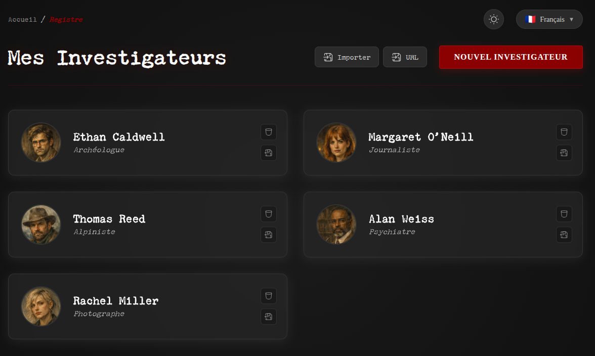
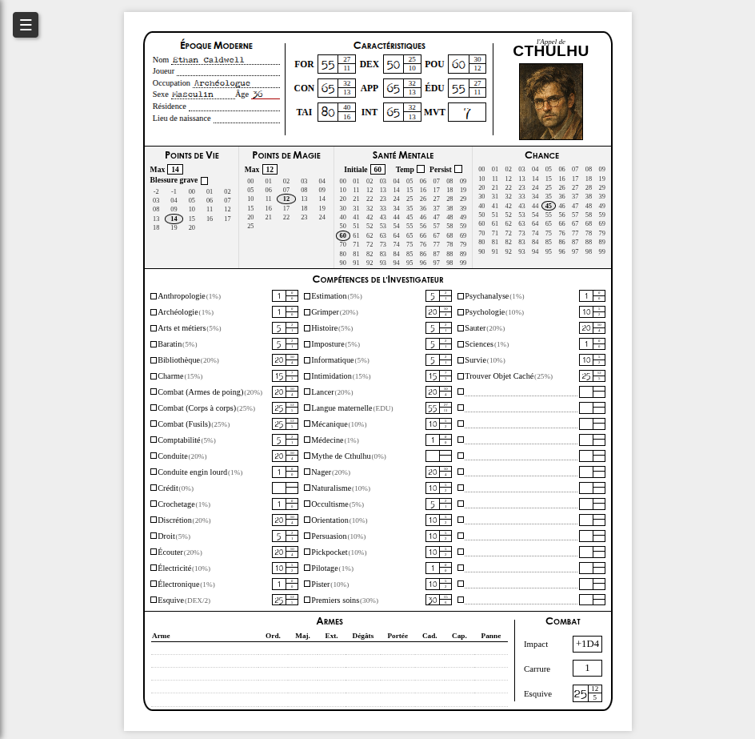
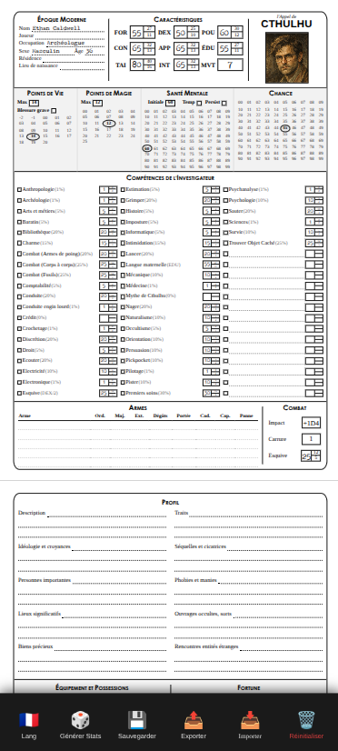

# Arkham Registry

A modern, responsive web-based character sheet editor compatible with **Call of Cthulhu 7th Edition**.

[](https://arkham-registry.online/)

## Overview

Arkham Registry is a comprehensive tool designed for Keepers and Players to manage investigator sheets easily. It provides a clean, digital interface that mimics the classic character sheet while adding modern features like automatic calculations, multi-language support, and easy data management.

### 📂 Examples

|                           Thumbnail                           | Name             |                       JSON                       |                                                                                        Action                                                                                        |
| :-----------------------------------------------------------: | :--------------- | :----------------------------------------------: | :----------------------------------------------------------------------------------------------------------------------------------------------------------------------------------: |
|   | Ethan Caldwell   |  [📄](examples/investigator-ethan-caldwell.json)  |      [📥 Import](https://arkham-registry.online/#/import/https%3A%2F%2Fraw.githubusercontent.com%2Fecyrbe%2Fcthulhu-editor%2Fmain%2Fexamples%2Finvestigator-ethan-caldwell.json)      |
|      | Thomas Reed      |   [📄](examples/investigator-thomas-reed.json)    |       [📥 Import](https://arkham-registry.online/#/import/https%3A%2F%2Fraw.githubusercontent.com%2Fecyrbe%2Fcthulhu-editor%2Fmain%2Fexamples%2Finvestigator-thomas-reed.json)        |
|       | Alan Weiss       |    [📄](examples/investigator-alan-weiss.json)    |        [📥 Import](https://arkham-registry.online/#/import/https%3A%2F%2Fraw.githubusercontent.com%2Fecyrbe%2Fcthulhu-editor%2Fmain%2Fexamples%2Finvestigator-alan-weiss.json)        |
|  | Margaret O'Neill | [📄](examples/investigator-margaret-o’neill.json) | [📥 Import](https://arkham-registry.online/#/import/https%3A%2F%2Fraw.githubusercontent.com%2Fecyrbe%2Fcthulhu-editor%2Fmain%2Fexamples%2Finvestigator-margaret-o%E2%80%99neill.json) |
|    | Rachel Miller    |  [📄](examples/investigator-rachel-miller.json)   |      [📥 Import](https://arkham-registry.online/#/import/https%3A%2F%2Fraw.githubusercontent.com%2Fecyrbe%2Fcthulhu-editor%2Fmain%2Fexamples%2Finvestigator-rachel-miller.json)       |
|           | Emilly Caldwell  | [📄](examples/investigator-emilly-caldwell.json)  |     [📥 Import](https://arkham-registry.online/#/import/https%3A%2F%2Fraw.githubusercontent.com%2Fecyrbe%2Fcthulhu-editor%2Fmain%2Fexamples%2Finvestigator-emilly-caldwell.json)      |
|          | Ezekiel Carter   |  [📄](examples/investigator-ezekiel-carter.json)  |      [📥 Import](https://arkham-registry.online/#/import/https%3A%2F%2Fraw.githubusercontent.com%2Fecyrbe%2Fcthulhu-editor%2Fmain%2Fexamples%2Finvestigator-ezekiel-carter.json)      |
|            | Jonah Jensen     |   [📄](examples/investigator-jonah-jensen.json)   |       [📥 Import](https://arkham-registry.online/#/import/https%3A%2F%2Fraw.githubusercontent.com%2Fecyrbe%2Fcthulhu-editor%2Fmain%2Fexamples%2Finvestigator-jonah-jensen.json)       |
|           | Julian Baxter    |  [📄](examples/investigator-julian-baxter.json)   |      [📥 Import](https://arkham-registry.online/#/import/https%3A%2F%2Fraw.githubusercontent.com%2Fecyrbe%2Fcthulhu-editor%2Fmain%2Fexamples%2Finvestigator-julian-baxter.json)       |
|             | Minh Tran        |    [📄](examples/investigator-minh-tran.json)     |        [📥 Import](https://arkham-registry.online/#/import/https%3A%2F%2Fraw.githubusercontent.com%2Fecyrbe%2Fcthulhu-editor%2Fmain%2Fexamples%2Finvestigator-minh-tran.json)         |

- **🖋️ [New Empty Character](https://arkham-registry.online/)**

## Screenshots

### Registry View



### Desktop View



### Mobile View



## Features

- **Full Character Sheet**: Manage Identity, Characteristics, Skills, Combat stats, Backstory, Gear, and more.
- **Investigator Registry**: A dedicated dashboard to create, manage, and organize multiple character sheets.
- **Local Persistence**: Automatically saves your investigators in your browser using IndexedDB.
- **Responsive Design**: Optimized for both desktop and mobile devices.
- **Interactive Trackers**: Easily track Hit Points, Sanity, Luck, and Magic Points.
- **Weapon & Combat Management**: Dedicated sections for weapons and combat calculations.
- **Multi-language Support**: Available in English, Spanish, French, German, and Portuguese.
- **Import/Export**: Save your investigator data as JSON files or import them from local storage or remote URLs.
- **Printable**: Formatted specifically for printing to take your digital sheet to the physical table.
- **Aide Memoire**: Quick reference for common rules and rolls.
- **Rolling System**: Built-in support for character initialization and rolling.
- **Zoom Controls**: Flexible zooming options to fit the sheet to width, height, or reset to default level.

## 🔗 Sharing & Remote Loading

You can share your character sheets or load them remotely by hosting the character JSON file (e.g., on GitHub, Gist, or any public static file host) and using the following URL format:

`https://arkham-registry.online/#/import/<ENCODED_JSON_URL>`

### Example:
If your JSON is hosted at `https://example.com/character.json`, the sharing link would be:
`https://arkham-registry.online/#/import/https%3A%2F%2Fexample.com%2Fcharacter.json`

When a user opens this link:
1. The editor fetches the JSON data from the provided URL.
2. It validates the data format.
3. It automatically saves the character into the user's local registry.
4. It redirects the user straight to the Editor.

## Tech Stack

- **React** + **TypeScript**
- **Vite**
- **i18next** for Internationalization

## Getting Started

### Prerequisites

- [Node.js](https://nodejs.org/) (v18 or higher recommended)
- [npm](https://www.npmjs.com/) or [yarn](https://yarnpkg.com/)

### Installation

1. Clone the repository:

   ```bash
   git clone https://github.com/ecyrbe/cthulhu-editor.git
   ```

2. Navigate to the project directory:

   ```bash
   cd cthulhu-editor
   ```

3. Install dependencies:

   ```bash
   npm install
   ```

4. Start the development server:
   ```bash
   npm run dev
   ```

## Contributing

Contributions are welcome! Feel free to open issues or submit pull requests to improve the editor.

## License

This project is licensed under the GNU General Public License v2.0 - see the [LICENSE](LICENSE) file for details.

## Copyright Notice

**Code Copyright © 2024-2025 ecyrbe.** All rights reserved.

This editor uses trademarks and/or copyrights owned by Chaosium Inc/Moon Design Publications LLC, which are used under Chaosium Inc’s Fan Material Policy. We are expressly prohibited from charging you to use or access this content. This Character Sheet editor is not published, endorsed, or specifically approved by Chaosium Inc. For more information about Chaosium Inc’s products, please visit [www.chaosium.com](https://www.chaosium.com).
